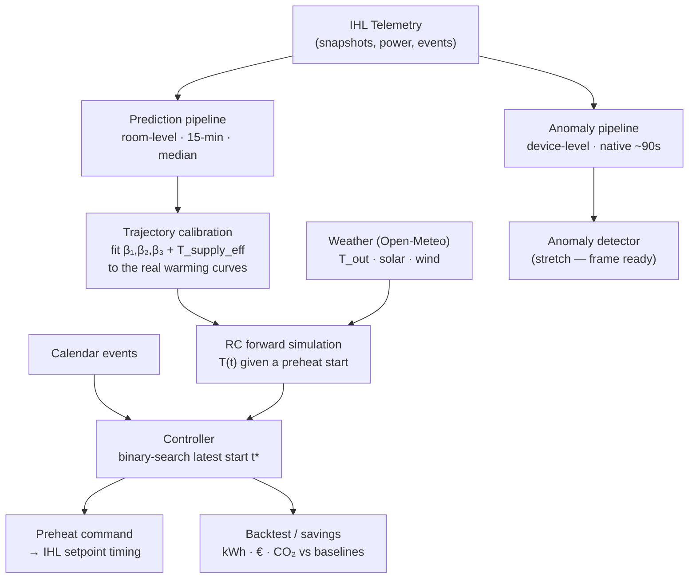
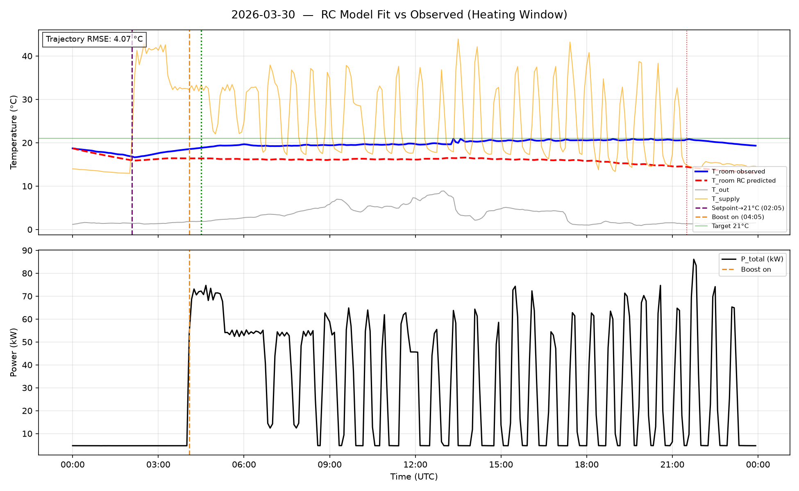
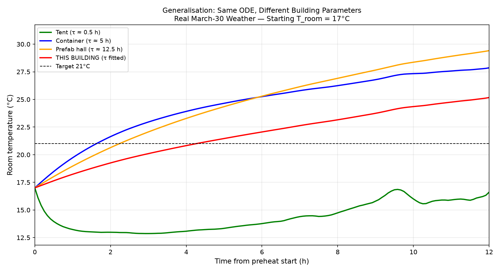
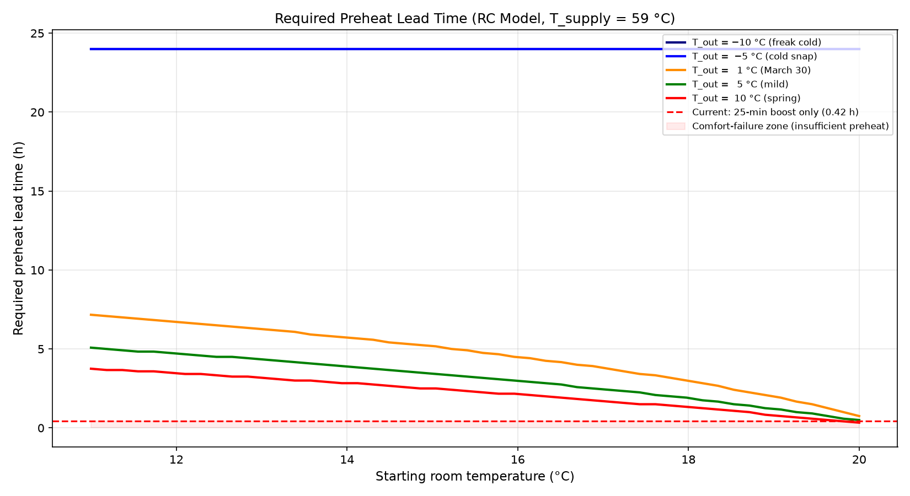

<div align="center">

# 🔥 Adaptive Predictive Preheat Control

### One physics-informed thermal model whose structure is identical for every building — from canvas tents to concrete lecture halls — calibrated per building from its own telemetry, telling the heat pump the exact moment to start.

**LBenergy GmbH × TUM Hackathon** — *“Building of the Future: Intelligent Control of Mobile Structures”*


-blue)


</div>

---

## The 9-Hour Problem

> On **March 30, 2026**, the heating switched on 2 h 25 min before the first lecture.
> When students walked in, the room was still **2.2 °C too cold**.
> It didn't hit the 21 °C target until **9 hours later.**

Mobile and temporary buildings waste energy because heat pumps either run continuously or follow fixed schedules that ignore building physics. A hard-coded preheat offset can't know that a sub-zero morning needs a multi-hour head start — so it either overheats (wasting energy) or underheats (failing comfort).

**We close that gap** — and we do it given a hard operational constraint: we can only command *when the setpoint changes* (preheat timing); we cannot switch individual heat pumps on or off.

---

## The Idea in One Picture

Every heating curve has the same shape — an approach toward setpoint — only the **time constant `τ`** differs between a tent and a lecture hall. So we separate **universal physics** from **building-specific parameters**, and fit the parameters from each building's own telemetry. We use a linearised, supply-air-driven grey-box form (the quantity the IHL sensors actually measure):

```
dT_room/dt = β₁·(T_supply − T_room) + β₂·(T_room − T_outside) + β₃
              └── heating drive ──┘   └─── heat loss ───┘     └ gains ┘
   β₁ = supply-air effectiveness   β₂ = −1/τ (insulation)   β₃ = solar/occupancy
```

`β₂ = −1/τ` is the building-specific insulation term; the *equations* are universal, only `{β₁, β₂, β₃}` change per building. (Illustrative regimes — actual values are fitted per building:)

| Building Type | τ = −1/β₂ | Preheat window |
|---|---|---|
| Thin tent (canvas) | minutes | minutes |
| Prefab container | 1–10 h | 1–4 hours |
| Lecture hall (concrete + glazing) | 5–30 h | 2–12 hours |

The same model, the same code — different parameters. The generalisation is *structural*: we demonstrate it with a parameter sweep across envelope types driven by the real weather trace (a single-building dataset can't prove it empirically — that's the honest framing).

---

## The Key Discovery — Two-Stage Heating

Reading the real data revealed *why* the current system fails and *where* the savings are. The building heats in **two distinct modes**:

| Mode | Mechanism | Electrical power | Cost |
|---|---|---|---|
| **Mode 1** | Fan + **hot-water coil** (district heat / gas) | **~4.7 kW** | cheap |
| **Mode 2** | **Electric boost** | **~70 kW** | ~15× more per electrical kWh |

> Verified from `power_draw.csv`: from 01:30–04:00 on Mar 30 the electrical draw stayed flat at **4.69 kW** while supply air rose to ~59 °C and the room warmed — proof the heat comes from a **non-electrical coil**, not a resistive element. Then a **70 kW electric boost** kicks in for the last ~25 min — and the room *still* missed comfort.

**Our strategy:** start the cheap Mode-1 coil a few hours earlier so the room reaches comfort on time and the expensive Mode-2 boost is never needed. This requires only setpoint-timing control — exactly what we're allowed to change.

> ⚠️ **Note on supply temperature:** 59 °C is *one device's* reading; the model is fit on the **median ~37.5 °C** across the 4 heat pumps (they heat heterogeneously). The controller uses the same 37.5 °C, so fit and control are consistent.

---

## How It Works



1. **Two pipelines, one shared core.** A shared loader + `clean()` feed a **prediction** frame (room-level, 15-min, median-aggregated) and an **anomaly** frame (device-level, native ~90 s). See [`PIPELINE.md`](docs/beststart_prediction/PIPELINE.md).
2. **Trajectory calibration.** Parameters are fit to reproduce the real warming *curves* (not instantaneous rates, which overstate warming and miss thermal-mass lag) — giving realistic lead times. See `fit_heatup_trajectory`.
3. **Physics core.** A 1-state RC ODE (forward Euler) that extrapolates sensibly under unseen weather, where a pure ML model would fail silently.
4. **Decision output.** Binary-search the *latest* preheat start `t*` that reaches setpoint by event start — leaning on cheap Mode-1 and avoiding the Mode-2 boost.
5. **ML residual** (LightGBM, `residual.py`) — scaffolded as a stretch accuracy layer.

---

## Results — Backtest on the Heating Window

Event-level counterfactual over the 7 (deduped) morning preheats: **B1 = current system (observed from data)** vs **B3 = our controller (simulated with the calibrated model)**.

| Metric | B1 — current | B3 — ours |
|---|---|---|
| On-time (room ≥ 20.5 °C at event start) | **0 / 7** ❌ | **7 / 7** ✅ |
| Mean room temp at deadline | **18.5 °C** | 20.5 °C |
| Mean preheat lead | ~2.5 h (fixed) | **~4.1 h** (adaptive) |
| Preheat-window electrical energy | 788 kWh | 230 kWh |

**Estimated saving: ~558 kWh · ~71% · €167 · 223 kg CO₂** over 7 mornings — *electrical energy, preheat window, by avoiding the Mode-2 boost*. Model heat-up ramp fit: **0.17 °C RMSE**. (€/CO₂ factors are labelled assumptions; B3 comfort is a model prediction, B1 is observed.)

Run it yourself: `python scripts/backtest.py --window heating`

<div align="center">

| RC Fit | Building Sweep | Preheat Map |
|:---:|:---:|:---:|
|  |  |  |

</div>

---

## Targets vs. Status

| Objective | Target | Status |
|---|---|---|
| Heat-up ramp trajectory fit | < 0.5 °C | ✅ 0.17 °C |
| Realistic preheat lead time | match observed | ✅ ~4 h (was bogus 2.7 h before calibration) |
| On-time comfort rate | > 90% | ✅ 7/7 (model) vs 0/7 current |
| Heating → cooling generalisation | RMSE < 1 °C | 🔶 cross-window check wired; cooling controller pending |
| Energy saved vs. current | meaningful | ✅ ~71% electrical in preheat window (boost avoided) |

---

## Repository Structure

```
Fenners-LBEnergy/
├── data/                          # IHL research dataset (UTC, ~90 s cadence, 4 heat pumps)
│   ├── README.md                  # full schema + Modbus error-register reference
│   ├── devices.csv
│   ├── heating_2026-03-30_to_2026-04-05/
│   └── cooling_2026-05-25_to_2026-05-31/
├── docs/
│   ├── PDR.md                     # Project Definition Report (full technical spec)
│   ├── callenge_discription.pdf   # original hackathon brief
│   └── beststart_prediction/
│       ├── PIPELINE.md            # how to use the data pipeline (start here)
│       ├── DATA_CONTRACT.md       # data schema + cleaning contract (the two pipelines)
│       ├── MODEL_DESIGN.md        # model architecture deep-dive
│       ├── comparisson.md         # RC vs RL approach decision
│       ├── IHL_optimal_start_guide.md
│       └── plan_yassir.md         # RL plan (deferred to future work)
├── src/
│   └── lbenergy/                  # importable model package
│       ├── config.py              # paths, grids, thresholds, savings assumptions
│       ├── data.py                # shared loaders + clean() + 2 pipeline builders
│       ├── pipeline.py            # run_pipeline (prediction) / run_anomaly_pipeline
│       ├── external.py            # 2nd data source: weather (Open-Meteo) + join
│       ├── rc_model.py            # RC fit (OLS) + fit_heatup_trajectory + simulation
│       ├── preheat.py             # optimal preheat start-time controller
│       ├── backtest.py            # event-level backtest: B1 vs B3, kWh/€/CO₂
│       ├── residual.py            # LightGBM residual corrector (scaffold)
│       ├── evaluate.py            # cross-window validation + metrics
│       └── plots.py               # diagnostic plotting
├── api.py                         # FastAPI layer for the frontend (no DB)
├── scripts/                       # thin CLI entrypoints
│   ├── train.py                   # calibrate → models/rc_params.json
│   ├── backtest.py                # run the event-level backtest → outputs/
│   └── run_diagnostics.py         # full analysis → outputs/
├── models/                        # fitted artifacts (rc_params.json: β + T_supply_eff)
├── outputs/                       # diagnostic plots + backtest CSVs
└── requirements.txt
```

---

## Getting Started

```bash
# 1. Install dependencies
pip install -r requirements.txt

# 2. Calibrate the model  (writes models/rc_params.json: β + T_supply_eff)
python scripts/train.py

# 3. Run the event-level backtest  (B1 vs B3 → outputs/backtest_heating.csv)
python scripts/backtest.py --window heating

# 4. (optional) Full diagnostics  (writes plots to outputs/)
python scripts/run_diagnostics.py
```

```python
# Or use the package directly:
from lbenergy import run_pipeline, run_anomaly_pipeline, run_backtest
df, events = run_pipeline("heating")        # prediction frame (room-level, 15-min)
adf        = run_anomaly_pipeline("heating") # anomaly frame (device-level, ~90 s)
per_event, summary = run_backtest("heating") # validation + savings
```

See [`PIPELINE.md`](docs/beststart_prediction/PIPELINE.md) for the full how-to, and [`data/README.md`](data/README.md) for the dataset schema.

---

## Frontend Integration — API (no database)

The frontend talks to the model over a thin **FastAPI** layer. There's **no database**: the
data is fixed historical CSVs and the model computes results in memory (calibrated once at
startup, ~0.2 s per request).

```bash
uvicorn api:app --reload      # serves http://127.0.0.1:8000  (docs at /docs)
```

| Endpoint | Returns | Frontend use |
|---|---|---|
| `GET /health` | liveness | — |
| `GET /model` | calibrated β, τ, `T_supply_eff` | "how the model was fit" |
| `GET /backtest?window=heating` | summary + per-event B1-vs-B3 | savings dashboard |
| `GET /preheat?t_room=&t_out=&hours=&setpoint=` | lead time + trajectory | live controller + "−2 °C" what-if |
| `GET /trajectory?window=&index=` | observed vs simulated curve | comfort chart |

CORS is open for any origin during the hackathon. The frontend just `fetch()`es these — e.g.
`fetch('http://127.0.0.1:8000/backtest?window=heating')`.

---

## Tech Stack

| Layer | Choice |
|---|---|
| RC simulation | Forward-Euler integration of the 1-state ODE (`rc_model.simulate_trajectory`) |
| System identification | `numpy.linalg.lstsq` (OLS) + `scipy.optimize.minimize` (trajectory calibration) |
| Data pipeline | pandas (CSV → two frames); native ~90 s for anomaly, 15-min for prediction |
| ML residual (stretch) | LightGBM (quantile regression for uncertainty) |
| Weather | Open-Meteo API (free, EU-hosted) — cached to `data/_external_cache/` |
| Frontend API | FastAPI + uvicorn (`api.py`) — no database |
| Demo (planned) | Streamlit / Jupyter |

---

## Documentation

- 📄 **[Project Definition Report](docs/PDR.md)** — problem, dataset analysis, technical approach, evaluation, roadmap.
- 🛠️ **[Pipeline Guide](docs/beststart_prediction/PIPELINE.md)** — how to use the data pipeline.
- 📐 **[Data Contract](docs/beststart_prediction/DATA_CONTRACT.md)** — schema + cleaning contract for the two pipelines.
- 🧠 **[Model Design](docs/beststart_prediction/MODEL_DESIGN.md)** — architecture deep-dive.
- ⚖️ **[Approach Decision](docs/beststart_prediction/comparisson.md)** — why RC preheat-timing over RL.

---

<div align="center">

**Built for the TUM Hackathon in partnership with [LBenergy GmbH](https://www.lbenergy.tech)** — makers of the Intelligent Heat Link (IHL).

*Same model. Same code. Any building.*

</div>
