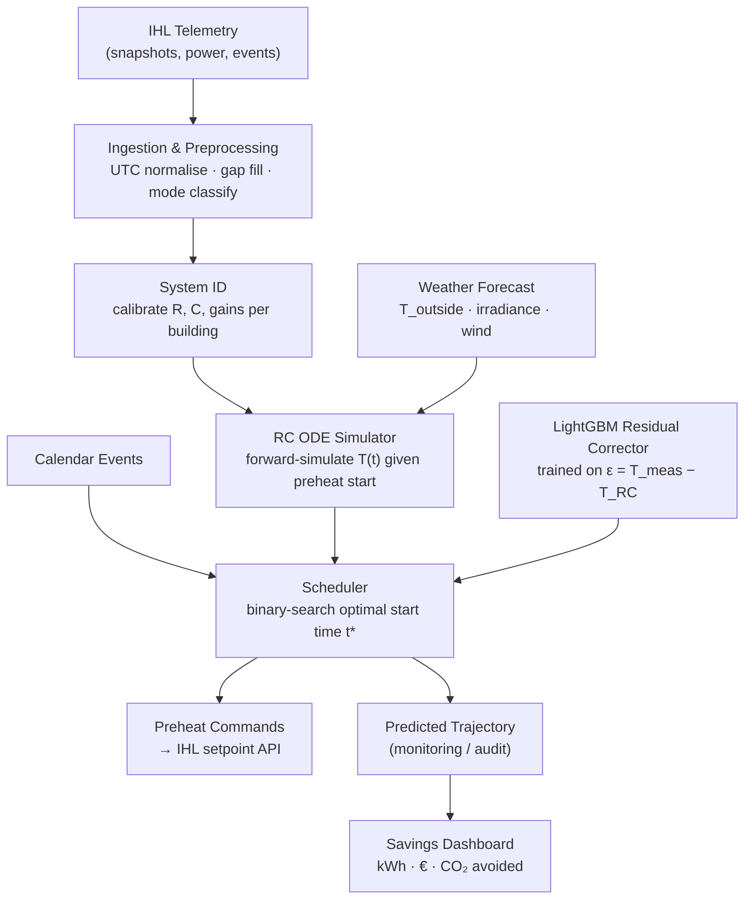

<div align="center">

# 🔥 Adaptive Predictive Preheat Control

### One physics-informed thermal model that self-calibrates to *any* building — from canvas tents to concrete lecture halls — and tells the heat pump the exact moment to start.

**LBenergy GmbH × TUM Hackathon** — *“Building of the Future: Intelligent Control of Mobile Structures”*


</div>

---

## The 9-Hour Problem

> On **March 30, 2026**, the heating switched on 2 h 25 min before the first lecture.
> When students walked in, the room was still **2.2 °C too cold**.
> It didn't hit the 21 °C target until **9 hours later.**

Mobile and temporary buildings waste enormous energy because heat pumps either run continuously or follow fixed schedules that ignore building physics. A hard-coded preheat offset can't know that a sub-zero morning needs a 6-hour head start — so it either overheats (wasting energy) or underheats (failing comfort).

**We close that gap.**

---

## The Idea in One Picture

The shape of every heating curve is the same exponential approach to setpoint — only the *time constant* `τ = R·C` differs between a tent and a lecture hall. So we separate **universal physics** from **building-specific parameters**, and learn the parameters automatically from each building's own telemetry.

```
dT_room/dt = (1/C) × [ Q_heater + Q_solar + Q_occupancy − (T_room − T_outside) / R ]
              └────────────────────── universal RC physics ──────────────────────┘
                                   {R, C, gain}  ← self-calibrated per building
```

| Building Type | R (°C/kW) | C (kWh/°C) | τ = RC | Preheat window |
|---|---|---|---|---|
| Thin tent (canvas) | 0.3–0.8 | 0.1–0.3 | minutes | Minutes |
| Prefab container | 2–5 | 0.5–2 | 1–10 h | 1–4 hours |
| Lecture hall (concrete + glazing) | 5–15 | 5–30 | 5–30 h | 2–12 hours |

The same model, the same code — different parameters. Deploy it to a new building, it learns in **3 days**, no manual setup.

---

## How It Works



1. **Self-calibration** — fit `{R, C, heater_gain}` from the building's own IHL telemetry via grey-box system identification (`scipy.optimize.curve_fit`).
2. **Physics core** — a 1R1C lumped-parameter ODE that extrapolates correctly even under freak weather (a pure ML model would fail silently outside its training range).
3. **ML residual** — a lightweight LightGBM corrector mops up solar gain, occupancy, and defrost effects the physics misses.
4. **Decision output** — binary-search the *latest* preheat start time `t*` that reaches setpoint exactly when occupants arrive, plus a safety margin from quantified uncertainty.

---

## Results at a Glance

<div align="center">

| RC Fit | Building Sweep | Preheat Map |
|:---:|:---:|:---:|
|  |  |  |

</div>

**Replaying March 30 through the model:** given −0.3 °C outside and a room starting at 16.87 °C, it would start heating at **~10:30 pm the night before** — not 2 am — arriving at 21 °C right at the 04:30 UTC event start.

---

## Targets

| Objective | Threshold |
|---|---|
| Trajectory RMSE (held-out events) | < 0.5 °C |
| Preheat lead-time error | ±15 min |
| On-time comfort rate | > 90% of events |
| Heating → cooling generalisation (no retrain) | RMSE < 1.0 °C |
| Energy saved vs. baseline | 15–25% |

---

## Repository Structure

```
Fenners-LBEnergy/
├── data/                          # IHL research dataset (UTC, 90 s cadence, 4 heat pumps)
│   ├── README.md                  # full schema + Modbus error-register reference
│   ├── devices.csv
│   ├── HELOT_User_Manual-Air 35 II.pdf
│   ├── heating_2026-03-30_to_2026-04-05/
│   └── cooling_2026-05-25_to_2026-05-31/
├── docs/
│   ├── PDR.md                     # Project Definition Report (full technical spec)
│   ├── MODEL_DESIGN.md            # model architecture deep-dive
│   ├── IHL_optimal_start_guide.md # optimal-start algorithm guide
│   └── callenge_discription.pdf   # original hackathon brief
├── src/
│   └── explore_and_fit.py         # EDA + RC system identification
├── outputs/                       # diagnostic plots
└── plot_csvs.ipynb                # exploratory notebook
```

---

## Getting Started

```bash
# 1. Install dependencies
pip install numpy pandas scipy lightgbm matplotlib

# 2. Run the EDA + RC calibration
python src/explore_and_fit.py

# 3. Explore interactively
jupyter notebook plot_csvs.ipynb
```

The dataset lives under `data/` — see [`data/README.md`](data/README.md) for the full column schema, time windows, and heat-pump error-register decoding.

---

## Tech Stack

| Layer | Choice |
|---|---|
| RC ODE solver | `scipy.integrate.solve_ivp` |
| System identification | `scipy.optimize.curve_fit` (nonlinear least squares) |
| ML residual | LightGBM (quantile regression for uncertainty) |
| Weather | Open-Meteo API (free, EU-hosted) |
| Demo | Streamlit / Jupyter |

---

## Documentation

- 📄 **[Project Definition Report](docs/PDR.md)** — full problem statement, dataset analysis, technical approach, evaluation plan, and 48-hour roadmap.
- 🧠 **[Model Design](docs/MODEL_DESIGN.md)** — architecture deep-dive.
- 🚀 **[Optimal Start Guide](docs/IHL_optimal_start_guide.md)** — the preheat-timing algorithm.

---

<div align="center">

**Built for the TUM Hackathon in partnership with [LBenergy GmbH](https://www.lbenergy.tech)** — makers of the Intelligent Heat Link (IHL).

*Same model. Same code. Any building.*

</div>
