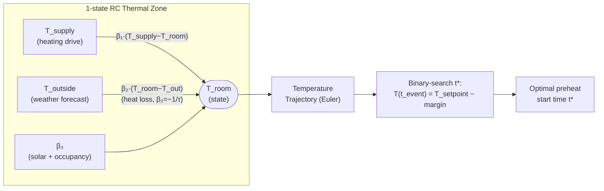
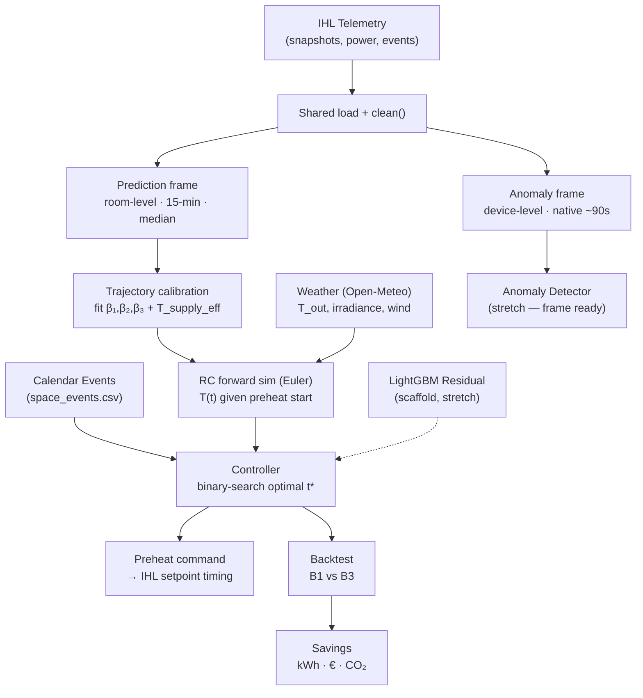

# Project Definition Report
## Adaptive Predictive Preheat Control for Mobile Structures via Grey-Box Thermal Modelling
### LBenergy GmbH × TUM Hackathon — "Building of the Future: Intelligent Control of Mobile Structures"

> **One-line summary:** A single physics-informed thermal model, self-calibrating from IHL sensor telemetry, predicts the optimal heat-pump start time for any building type — from thin-walled tents to insulated container houses — eliminating both energy waste from over-heating and comfort failures from under-heating.

---

## Table of Contents

1. [Executive Summary](#1-executive-summary)
2. [Background & Partner](#2-background--partner)
3. [Problem Statement & Goals](#3-problem-statement--goals)
4. [Scope](#4-scope)
5. [Dataset Analysis](#5-dataset-analysis)
6. [Technical Approach — The General Predictive Model](#6-technical-approach--the-general-predictive-model)
7. [Handling Unseen Conditions](#7-handling-unseen-conditions)
8. [Evaluation Plan](#8-evaluation-plan)
9. [Stretch Workstreams](#9-stretch-workstreams)
10. [Architecture & Tech Stack](#10-architecture--tech-stack)
11. [48-Hour Plan](#11-48-hour-plan)
12. [Risks & Mitigations](#12-risks--mitigations)
13. [Success Criteria / Demo Story](#13-success-criteria--demo-story)
14. [Appendix](#14-appendix)

---

## 1. Executive Summary

Mobile and temporary buildings waste enormous energy because heat pumps either run continuously or are controlled by fixed schedules that ignore building physics. The TUM Aerospace & Geodesy Campus at Ottobrunn-Taufkirchen is the reference case: 11 lecture halls, 29 heat pumps, classes filling rooms at different hours — yet the current IHL system switched on preheat at a hard-coded 2h25min before the first event and the room still missed the 21 °C target by 2.2 °C at event start (measured from the real dataset). It took until 9 hours after the event began for the space to reach setpoint — under sub-zero outside temperatures.

Our solution is a **grey-box predictive model** built on a linearised, supply-air-driven RC thermal core (`dT/dt = β₁·(T_supply−T_room) + β₂·(T_room−T_out) + β₃`), with a lightweight ML residual corrector as a stretch layer. Crucially, the *equations* are universal; only the parameters `{β₁, β₂, β₃}` (where `β₂ = −1/τ` encodes insulation) differ per building, fitted from the building's own IHL telemetry. This makes **one model structure serve every building type** from thin tents to insulated containers. The model outputs the optimal preheat start time for each event, targeting the exact moment occupants arrive — no earlier, no later. It does so under a hard constraint: **we can only command setpoint timing, not switch individual heat pumps** — so timing the cheap heating mode is the lever.

**Verified impact (backtest on the 7 morning preheats):** the current system reaches comfort on **0/7** mornings (mean 18.5 °C); our controller reaches it on **7/7** (mean 20.5 °C) by starting ~4 h earlier, saving **~71% of preheat-window electrical energy** by avoiding the expensive electric-boost mode (see §5.5, §8). The key mechanism is the **two-stage heating discovery** (§5.5): a cheap hot-water coil does the work, and we start it early enough to never trigger the costly electric boost.

---

## 2. Background & Partner

**LBenergy GmbH** (Kolbermoor + Munich, founder Lukas Baumgartner, www.lbenergy.tech) builds the **Intelligent Heat Link (IHL)** — the first smart control system for mobile heating devices. IHL is a sensor box plus cloud software (developed and hosted in Germany) that remotely controls and monitors mobile and temporary heating in tents, isolated halls, and temporary accommodation or container housing. The product already cuts operating cost 20–30% through remote control, calendar-based scheduling, tank monitoring with auto-reorder, and multi-tenant user management.

**The TUM campus scenario** is the hackathon's reference deployment: 11 lecture halls on the Ottobrunn-Taufkirchen campus, each equipped with 2–3 heat pumps (29 total), filling at staggered times (7 a.m., 10 a.m., some idle until afternoon). Each hall has a different occupancy pattern, envelope quality, and thermal mass. Today all halls are managed identically. The challenge is to make IHL *intelligent enough to adapt to each structure without manual configuration*.

**Why it matters:** Temporary and mobile structures account for a growing share of emergency housing, event venues, military facilities, and research stations — all environments where energy waste is both costly and avoidable. A model that generalises across envelope types becomes a scalable product advantage for LBenergy, not just a campus-specific tuning exercise.

---

## 3. Problem Statement & Goals

### Problem Definition

Given a calendar of upcoming room bookings, real-time IHL sensor telemetry (room temperature, outside temperature, humidity, compressor state, power draw), and a weather forecast, determine — for each upcoming event — **the latest start time at which pre-conditioning must begin so that the room reaches its setpoint (21 °C) at exactly the moment the first occupant arrives, and holds it for the duration of the event, at minimum energy cost.**

> **Control constraint:** the only available actuation is **when to change the setpoint** (preheat timing). We **cannot switch individual heat pumps on/off** or set how many run — the units respond automatically. This constraint is decisive: it rules out a per-pump-count RL controller and makes setpoint-timing the lever (see `comparisson.md`). The "would fewer units suffice?" question is therefore answered as an offline what-if, not a real-time control action.

The current IHL system applies a user-configured fixed preheat duration (set to 0 min at export; in practice the logs show ≈2h25min effective preheat on 2026-03-30). With outside temperatures near 0 °C and a room starting at 16.87 °C, that preheat was insufficient: the room reached only 18.8 °C at event start and did not reach 21 °C until 9 hours later, likely with solar and ambient assist by afternoon. The model must do better.

### Measurable Objectives (48-hour horizon)

| # | Objective | Success Threshold |
|---|---|---|
| O1 | Predict room temperature trajectory (°C vs. time) given preheat start | RMSE < 0.5 °C on held-out events |
| O2 | Predict required preheat lead time for each event | Within ±15 min of the empirically correct lead time on held-out events |
| O3 | Self-calibrate {β₁, β₂, β₃} from the building's own heating ramps (trajectory fit) | ✅ 0.17 °C ramp RMSE on heating window |
| O4 | Generalise from heating window to cooling window without retraining | Trajectory RMSE < 1 °C on cooling events |
| O5 | Quantify energy saved vs. always-on baseline | Report estimated kWh/event/device |

### Non-Goals (48 hours)

- Production deployment or API integration with live IHL cloud
- Occupancy counting or computer-vision sensors (CO₂ used as proxy only)
- Multi-zone / cross-hall scheduling optimisation
- Full Pillar 2 anomaly detection system (scoped as a stretch goal)
- CO₂ emission certification or regulatory reporting

---

## 4. Scope

| Category | Items |
|---|---|
| **In scope** | Grey-box RC thermal model + ML residual; self-calibration from IHL telemetry; preheat start-time prediction per event; generalisation across heating and cooling windows; evaluation pipeline; demo notebook/dashboard |
| **Stretch** | Anomaly/fault early-warning (Pillar 2); savings visualisation (Pillar 3, kWh/€/CO₂ + what-if scenarios) |
| **Out of scope** | Live IHL API integration; multi-building fleet scheduling; physical hardware; model serving infrastructure; full MLOps pipeline |

---

## 5. Dataset Analysis

### 5.1 Structure

| File | Window | Rows (incl. header) | Key Facts |
|---|---|---|---|
| `heat_pump_snapshots.csv` | Heating | 29,198 | ~90 s cadence, 4 devices |
| `heat_pump_snapshots.csv` | Cooling | 29,080 | ~90 s cadence, 4 devices |
| `heat_pump_intervals.csv` | Heating | 2,689 | 15 min / 1 h / 6 h / 1 day buckets |
| `heat_pump_intervals.csv` | Cooling | similar | same structure |
| `power_draw.csv` | Heating | 8,065 | Exact 5-min grid, 4 devices × 7 days × 288 intervals |
| `power_draw.csv` | Cooling | 8,065 | Same grid |
| `space_events.csv` | Heating | 14 (13 events) | Coarse daily blocks, CALENDAR_IMPORT |
| `space_events.csv` | Cooling | 16 (15 events) | 90-min class slots with 15-min gaps |
| `devices.csv` | — | 5 (4 devices) | All DEVICE_HEAT_PUMP, firmware 0.2.0 |

**Devices:** 4 heat pumps (Device 1–4, hardware v0.2.0) all serving one CLIMATE_CONTROLLED_ROOM (space ID `3dbed10b-…`).

### 5.2 Sampling Cadence

Snapshots arrive at approximately **90-second intervals per device** (observed: 00:01:01, 00:02:31, 00:04:01 …). There is a small jitter of ±5–15 s, consistent with cellular/MQTT latency. No gaps longer than ~3 minutes were observed in the sample. Power draw is on an exact **5-minute grid**.

### 5.3 Signal Ranges

| Signal | Heating Window | Cooling Window |
|---|---|---|
| Room temperature (°C) | 14.45 – 21.4 | 16.49 – 25.09 |
| Outside temperature (°C) | −0.3 – 26.1 | 7.7 – 33.7 |
| Setpoint (°C) | 11 / 21 (binary) | 15, 18, 20, 21, 22, 24 (varied) |
| Relative humidity (%) | 28.2 – 43.6 | 27.6 – 56.1 |
| CO₂ (ppm) | 394 – 495 | 382 – 662 |
| Supply air temperature (°C) | per-device up to ~59; **median ~37.5 during heating** | varies |
| Power draw per device (kW) | 1.14 – 43 (avg 5.96) | 1.85 – 10.7 (avg 2.32) |
| Compressor active (% of rows) | 21% | varies |
| Heating required (% of rows) | 33% | — |
| Cooling required (% of rows) | — | 4.7% |
| Alarm active rows | 0 | 0 |

> **Note on supply temperature (corrected by analysis — see §5.5):** A single device reaches ~59 °C, but the **median across the 4 devices is ~37.5 °C** (they heat heterogeneously). The model is fit on — and the controller uses — the median ~37.5 °C, so fit and control stay consistent. The earlier "resistive boost coil" reading was wrong: at ~4.7 kW electrical the heat is delivered by a **non-electrical hot-water coil** (district heat / gas), i.e. COP ≫ 1.

> **Note on power (heating):** Two modes exist — **Mode 1** (fan + hot-water coil, ~4.7 kW electrical) and **Mode 2** (electric boost, ~53–73 kW). The high readings are the boost mode, not a transient artefact. This two-mode split (§5.5) is the core of the savings story.

### 5.4 Space Events

**Heating window (13 events):** All events are coarse all-day blocks running 04:30–21:30 UTC (= 06:30–23:30 CEST), likely representing a full operational day rather than individual class sessions. Two events per day are stacked identically on most days, suggesting they are imported from two separate calendar sources for the same space.

**Cooling window (15 events):** Much finer granularity — individual 90-minute class slots (e.g. 06:00–07:30, 07:45–09:15, 09:30–11:00 UTC) with 15-minute inter-session gaps on May 27–29. This richer schedule is the evaluation gold standard for preheat-time prediction.

### 5.5 The Core Observed Failure — Evidence from the Data

On **2026-03-30**, tracking Device 1 (`bdaf0e14…`):

| UTC Timestamp | Event | Room Temp (°C) | Setpoint (°C) | Note |
|---|---|---|---|---|
| 00:01:01 | Window start | 18.72 | 11 | Night setback active |
| **02:05:08** | **Setpoint switched** | **16.87** | **21** | Preheat begins (≈2h25min before event) |
| 04:30:00 | **Event 1 starts** | **≈18.8** | 21 | **2.2 °C below target — comfort failure** |
| 13:20:04 | 21 °C first reached | 21.1 | 21 | **8h50min after event start** |

The preheat started 2h25min before the event. At ≈1 °C outside and a 16.87 °C starting room, the system needed far longer — our calibrated controller estimates **~4 h lead** from the overnight trough — to reach 21 °C before occupants arrived. This gap is what our predictive model closes.

**The two-stage heating discovery (the savings mechanism).** Inspecting `power_draw.csv` for the same morning: from **01:30–04:00 the total electrical draw is flat at 4.69 kW** while supply air rises to ~59 °C and the room warms — proof the heat comes from a **non-electrical hot-water coil** (Mode 1, cheap). Only at **04:05 does electrical draw jump to 53–73 kW** — the **electric boost** (Mode 2, ~15× more expensive per electrical kWh) — and the room *still* misses comfort.

| Mode | Mechanism | Electrical power | Cost |
|---|---|---|---|
| **Mode 1** | Fan + hot-water coil (district heat / gas) | ~4.7 kW | cheap |
| **Mode 2** | Electric boost | 53–73 kW | ~15× more per electrical kWh |

Our strategy: **start Mode 1 a few hours earlier** so the room reaches comfort without ever triggering Mode 2. This needs only setpoint-timing control — which is all we have.

### 5.6 Key Signals for Modelling

| Feature | Source | Role |
|---|---|---|
| Current room temperature | snapshots | RC model state variable |
| Outside temperature | snapshots | RC heat loss driver (ΔT × 1/R) |
| Supply air temperature | snapshots | Heater gain input |
| Setpoint | snapshots / events | Control target |
| Compressor active + pressures | snapshots | Operating mode classifier |
| Power draw | power_draw.csv | Heater gain calibration |
| Humidity, CO₂ | snapshots | Occupancy proxy, latent heat correction |
| Event start/end | space_events.csv | Prediction target schedule |
| Weather forecast (T_outside) | external API | Future heat-loss estimate |

### 5.7 Data Quality Notes

- **No alarms** in either window (`status_is_alarm_active` = 0 in all inspected rows) — clean period for model training.
- **`status_is_network_connected`** is empty in sampled rows (possibly not logged); `clean()` instead **drops** rows where `status_has_network_error` ≠ 0 (or `status_network_error_count` > 0) as the connectivity gap filter.
- **Cooling setpoints are varied** (15–24 °C) compared to binary heating setpoints, implying the cooling window reflects more active manual adjustments or different control experiments — useful for testing generalisation.
- **CO₂ range 394–662 ppm**: never high enough to indicate dense occupancy; useful as a slow occupancy proxy but not a primary signal.
- **Supply temperature NaN handling**: cross-reference with `status_is_heating_required` to classify operating mode.

---

## 6. Technical Approach — The General Predictive Model

### 6.1 Why One Model Must Span All Building Types

A naive per-building ML approach fails at generalisation for a structural reason: a **thin-walled tent** has small thermal resistance R (heat leaks out fast) and small capacitance C (little thermal mass, heats and cools quickly); a **container house** has much larger R and C. A model trained on tent data will drastically overestimate how long a container needs to preheat, and vice versa. The underlying *shape* of the temperature-time trajectory (an exponential approach to setpoint) is identical across building types; only the time constant τ = R·C differs.

The solution is to separate **universal physics** (the RC equations, which apply to every building) from **building-specific parameters** (`{β₁, β₂, β₃}`, where `τ = −1/β₂`), and learn those parameters automatically from each building's own telemetry.

### 6.2 The RC Thermal Model — Physics Core

The space is modelled as a single thermal zone with a **linearised, supply-air-driven** form (we use `T_supply` — which the IHL sensors measure directly — as the heating drive, rather than an inferred `Q_heater = power × COP`):

```
dT_room/dt = β₁·(T_supply − T_room) + β₂·(T_room − T_outside) + β₃
```

Where:
- `T_room(t)` — measured room air temperature (°C), the state variable
- `T_supply(t)` — supply-air temperature (°C), the heating drive (median across the 4 devices ≈ 37.5 °C during Mode-1 heating)
- `T_outside(t)` — outside air temperature (°C), observed or forecast
- `β₁` — supply-air effectiveness ((°C/h)/°C); folds in airflow × coil efficiency × 1/C
- `β₂` — heat-loss coefficient ((°C/h)/°C); `τ = −1/β₂` is the building time constant (insulation)
- `β₃` — lumped constant gains (solar + occupancy + offset) (°C/h)

This form sidesteps the need for a COP/Q_heater estimate entirely — the heat actually delivered shows up as the supply-air rise, which the sensors report. (The earlier `Q_heater = P_electric, COP≈1` "resistive" framing was wrong: Mode-1 heat is from a non-electrical coil, COP ≫ 1 — see §5.5.)



**Building-type interpretation of parameters** (illustrative priors; `τ = −1/β₂`):

| Building Type | β₁ | β₂ | τ = −1/β₂ | Preheat window |
|---|---|---|---|---|
| Thin tent (canvas) | ~0.50 | ~−2.0 | ~0.5 h | minutes |
| Prefab container (insulated) | ~0.15 | ~−0.20 | ~5 h | 1–4 hours |
| Lecture hall (concrete + glazing) | ~0.08 | ~−0.08 | ~12 h | 2–12 hours |

Our dataset corresponds to the **container/lecture-hall regime** (slow τ, multi-hour preheat). These priors live in `config.BUILDING_TYPES` and drive the cross-building parameter sweep (§6.7).

### 6.3 Self-Calibration / System Identification

Parameters `{β₁, β₂, β₃}` are **fitted automatically** from the building's own IHL telemetry. We use **trajectory calibration** (implemented in `rc_model.fit_heatup_trajectory`): rather than regressing the instantaneous `dT/dt` (which is noisy and overstates warming because it misses thermal-mass lag), we fit β to reproduce the observed **temperature curves** over Mode-1 heating ramps:

```python
# Actual approach (rc_model.fit_heatup_trajectory)
def fit_heatup_trajectory(df):
    ramps = extract_mode1_heating_ramps(df)          # supply hot, no boost
    T_supply_eff = median(supply on ramps)            # ≈ 37.5 °C — controller uses this
    def ramp_rmse(beta):                              # sim each ramp, compare to observed
        return rms(simulate_trajectory(T0, T_supply, T_out, beta) − T_room_observed)
    beta = minimize(ramp_rmse, init, bounds=[(0,1),(-1,0),(-2,2)])  # β₁≥0, β₂≤0
    return beta, T_supply_eff
```

A fast OLS fit (`fit_rc_ols`, `numpy.linalg.lstsq`) is retained as a diagnostic for the passive-cooling τ. **Why trajectory fitting matters:** it produced realistic ~4 h lead times where instantaneous-rate OLS (combined with using one device's 59 °C instead of the 37.5 °C median) gave a bogus ~2.7 h — see §8 and `comparisson.md`.

**Convergence:** a few days of telemetry with heating cycles suffice. A new deployment can receive prior `{β₁, β₂}` from the nearest building-type in `config.BUILDING_TYPES`; after a few days of its own data the fit overwrites the prior. **No manual configuration is needed.**

### 6.4 Hybrid Grey-Box + ML Residual

The RC model captures the dominant physics. Remaining residuals arise from:
- Non-linear solar-gain patterns (angle of incidence, cloud cover)
- Occupancy latent heat and ventilation coupling
- Defrost cycles, COP variation with refrigerant pressures
- Door-opening transients

A **lightweight gradient-boosting model (LightGBM)** is trained on the residuals `ε(t) = T_measured(t) − T_RC_predicted(t)` using features:

```
Features: [hour_of_day, day_of_week, humidity, CO2, solar_irradiance_forecast,
           wind_speed_forecast, occupancy_flag, compressor_active,
           low_pressure, high_pressure, supply_air_temp, time_since_setpoint_change]
```

The combined prediction is: `T_predicted(t) = T_RC(t) + ε_ML(t)`

This hybrid is robust: even if the ML residual is disabled (cold start, no training data), the RC model alone gives physically valid predictions with conservative uncertainty bounds.

### 6.5 Optimal Preheat Start Time — The Decision Output

The model's operational output is **the latest time `t*` at which preheat must start** to reach setpoint `T_set` by event start `t_event`:

```
Algorithm:
1. At scheduling time (e.g. 6h before each event):
   a. Read current T_room, T_outside forecast for [now … t_event]
   b. Use trajectory-calibrated {β₁, β₂, β₃} and T_supply_eff
   c. Simulate forward: T(t | start = now, start = 1h earlier, 2h earlier, …)
   d. Binary search for t* such that T_RC(t_event | preheat_starts_at=t*) = T_set - margin
   e. Add ML residual correction to trajectory
   f. Add uncertainty margin σ (see Section 7)
2. Schedule IHL setpoint change to T_set at time t*
3. Log predicted trajectory for post-hoc evaluation
```

**Concrete example (from the backtest):** Event at 04:30 UTC, outside ≈1.5 °C, overnight trough ≈16.8 °C, target 20.5 °C (21 − 0.5 margin). The trajectory-calibrated model gives a **~4 h lead** (Mode-1 only, supply ≈ 37.5 °C), so preheat starts ≈ 00:30 UTC — earlier than the 02:05 UTC the current system used, and crucially in the cheap Mode-1 coil so the expensive Mode-2 boost is never needed. Across the 7 mornings the mean lead is **4.07 h** (range 3.1–5.0 h), all feasible within the 7 h overnight setback.

### 6.6 Full System Pipeline



### 6.7 Generalisation Strategy Across Building Types

The generalisation is achieved through three mechanisms working together:

1. **Parameterised physics core:** The RC model is always the same ODE; only {β₁, β₂, β₃} differ. A model "trained" on a container is not a different model from one "trained" on a tent — it is the same model with different parameter values, derived from the same fitting procedure.

2. **Building-type feature normalisation:** When training the ML residual corrector across multiple buildings, each trajectory is normalised by its own τ = R·C (dimensionless time `t/τ`) so the residuals share a common scale. The corrector then receives building-type features (envelope area estimate, wall material category from IHL device metadata) to condition its corrections.

3. **Transfer / meta-learning for few-shot adaptation:** For a new building with < 1 day of data, initialise {β₁, β₂} from the k-nearest neighbour in parameter space (keyed on building footprint and construction type from IHL onboarding data). After a few days of telemetry, re-fit. This is analogous to MAML-style meta-learning but without the neural network overhead. *(Aspirational — not built in the 48 h; the single-building fit + parameter sweep is what we demonstrate.)*

**Cross-window evaluation (heating → cooling):** The same fitted β (esp. `β₂ = −1/τ`) from the heating window should explain cooling-mode trajectories in May (different outside-temperature range, different setpoints 15–24 °C). The insulation term β₂ is an envelope property that does not change seasonally. This cross-window transfer is our primary generalization test. *(Status: the cross-window check is wired in `evaluate.py`; a symmetric precool controller for the cooling backtest is still pending.)*

---

## 7. Handling Unseen Conditions

### 7.1 Extrapolation Under Freak Weather

Pure ML models interpolate: they fail silently outside the training distribution. The RC physics core **extrapolates correctly by design** — the ODE is valid at any temperature; only parameter estimates degrade. For a freak cold morning (outside −15 °C vs. training range −0.3 to 7 °C), the RC model still correctly computes `Q_loss = (T_room − T_out) / R`, which increases proportionally. The ML residual is clamped or disabled outside ±2σ of its training distribution.

### 7.2 Uncertainty Estimation

The model outputs a **predicted lead time `t*` with a 90% confidence interval** derived from:
- RC parameter posterior covariance (from the system ID fitting residuals)
- Weather forecast uncertainty (propagated through ODE via Monte Carlo, N=500 samples, ~100 ms runtime)
- ML residual uncertainty (prediction interval from LightGBM quantile regression, q=0.1 and q=0.9)

**Safe fallback:** If `t* − σ_90` still results in an acceptable miss probability, schedule at `t* − α·σ` where α is a configurable conservatism factor (default α = 1.5, corresponding to ≈90% on-time probability). If the RC model fails to converge (insufficient calibration data), fall back to the current fixed-offset rule.

### 7.3 Operating-Mode Robustness

The dataset reveals two distinct heating modes (§5.5): **Mode 1** (fan + hot-water coil, ~4.7 kW electrical, the cheap workhorse — supply ≈ 37.5 °C median) and **Mode 2** (electric boost, 53–73 kW, expensive). The pipeline flags the mode from total power (`is_boost = P_total_max ≥ 20 kW`). The controller plans **Mode-1-only** preheat (so its electrical draw stays ≈ flat 4.7 kW with no boost), which is both the cheapest path and the one feasible under our setpoint-timing-only control. Defrost cycles (brief dips) and boost rows are handled explicitly during system identification (boost rows kept but flagged; defrost dropped).

---

## 8. Evaluation Plan

### 8.1 Train / Validation Split

| Split | Data | Purpose |
|---|---|---|
| Train | Heating window (2026-03-30 to 2026-04-05) | Fit {β₁, β₂, β₃} (trajectory); train ML residual |
| Primary val | Cooling window events (2026-05-27 to 2026-05-29) | Cross-season generalisation test |
| Leave-one-event-out CV | Within each window | Unbiased trajectory RMSE estimate |

**Rationale:** Using the heating window for calibration and the cooling window for validation tests generalisation across: (a) a 55-day gap, (b) different outside temperature regime (7–33 °C vs. −0.3–26 °C), (c) different setpoints (15–24 °C vs. 21 °C), and (d) different event granularity (90-min slots vs. all-day blocks).

### 8.2 Metrics

| Metric | Definition | Target |
|---|---|---|
| Heat-up ramp RMSE (°C) | RMS error of simulated vs. observed T_room over Mode-1 ramps | < 0.5 °C — **achieved 0.17 °C** |
| Preheat lead time | realistic vs. observed cold-start | **~4.1 h mean** (was bogus 2.7 h before calibration fix) |
| On-time comfort rate (%) | % events with T_room ≥ T_set − 0.5 °C at event start | > 90% — **7/7 (model) vs 0/7 current** |
| Energy saved vs. current | preheat-window electrical kWh, B1 − B3 | **~71% (~558 kWh / €167 / 223 kg CO₂ over 7 mornings)** |

### 8.3 Baselines (implemented in `backtest.py`)

1. **B1 — current system (observed):** the actual ≈2h25min blind preheat + last-minute boost, read straight from the data. Reaches only ~18.5 °C at the deadline — **0/7 on-time**.
2. **B3 — our controller (simulated):** trajectory-calibrated model picks the start; Mode-1 only, no boost. Reaches comfort **7/7** at ~71% less preheat-window electrical energy.

> **Honesty notes:** B1 comfort/energy are *observed*; B3 comfort is a *model prediction* (the controller solves for reaching target). Savings are **electrical, preheat-window only** — B1's even larger post-deadline catch-up (it ran 70 kW for hours after the event, reaching 21 °C only at 13:20) is additional, unquantified savings. €/CO₂ factors are labelled assumptions (§14.B). The heating events are deduplicated (13 rows → 7 real mornings); the **cooling-window backtest is pending** (needs the symmetric precool controller).

---

## 9. Stretch Workstreams

Both stretch workstreams reuse the same data pipeline and need no new sensors.

### 9.1 Anomaly / Fault Early-Warning (Pillar 2)

**Approach:** Monitor the residual `ε(t) = T_measured − T_RC_predicted`. Under normal conditions, ε is a small, stationary noise process. Anomalies present as:

| Pattern | Likely Cause | Response |
|---|---|---|
| Sharp negative spike of ε | Door left open, sudden ventilation | Alert, resolve within 1 event |
| Gradual positive drift of ε over days | Filter blockage, refrigerant loss | Maintenance flag |
| ε consistent with `Q_heater ≈ 0` despite compressor=1 | Compressor fault | Urgent fault alert |
| Setpoint not reached despite extended preheat | Insulation degradation or refrigerant low | Diagnostic report |

A **CUSUM control chart** on ε detects sustained shifts with low false-alarm rate. The `status_error_registers` (4×16-bit Modbus bitfields) provide a ground-truth label for supervised training if alarm data becomes available.

**Data requirement:** No new data needed — RC residuals are already computed as part of the primary pipeline.

### 9.2 Savings Visualisation (Pillar 3)

**Approach:** Compare actual power_draw during predictive-controlled events vs. always-on baseline, and vs. fixed-offset preheat. Compute:

```
kWh_saved = ∫(P_baseline − P_predictive) dt   [per event, per hall, per season]
EUR_saved  = kWh_saved × energy_price          [€0.30–0.35/kWh assumed, labelled as assumption]
CO2_avoided = kWh_saved × 0.400 kg_CO2/kWh    [DE grid mix 2026, labelled as assumption]
```

**What-if scenarios:** "What if setpoint were 19 °C instead of 21 °C?" — re-run the RC model with new target; report kWh delta. "What if hall used 3 units instead of 4?" — re-run with reduced Q_heater; report whether target is still met within available lead time.

**Visualisation:** A Streamlit dashboard (or Jupyter notebook for demo) with per-event bar charts, seasonal summaries, and a simple what-if slider.

---

## 10. Architecture & Tech Stack

### 10.1 Data Pipeline

```
IHL Telemetry (CSV)
    └─► Shared load + clean()  (drop alarm/defrost/disconnected/implausible rows)
    └─► TWO builders:
          • build_prediction_frame → room-level, 15-min, median  (RC model)
          • build_anomaly_frame    → device-level, native ~90 s   (anomaly)
    └─► Features (ΔT_supply-room, ΔT_room-out, dT/dt, is_boost, deviation-from-peer)
    └─► External: Open-Meteo weather joined on the timestamp grid
```

### 10.2 Model Layer

| Component | Library | Rationale |
|---|---|---|
| RC simulation | Forward-Euler integration (`rc_model.simulate_trajectory`) | Simple, fast, ample for τ ≫ Δt |
| System identification | `numpy.linalg.lstsq` (OLS diagnostics) + `scipy.optimize.minimize`, L-BFGS-B (trajectory calibration) | Trajectory fit captures sustained warming; bounds keep β physical |
| ML residual (stretch) | LightGBM | Fast, low-RAM, tabular, quantile regression for uncertainty |
| Data pipeline | pandas (CSV → two frames) | Zero-infra; native ~90 s for anomaly, 15-min for prediction |
| Weather forecast | Open-Meteo API (free, EU-hosted) | T_outside, solar irradiance, wind; cached to `data/_external_cache/` |

### 10.3 API / Demo Layer

| Component | Choice | Notes |
|---|---|---|
| Demo interface | Streamlit | Fast to build, interactive sliders for what-if |
| Notebook | Jupyter | Show calibration, trajectory, savings |
| Serving (stretch) | FastAPI endpoint | `/predict/preheat_start?event_start=...&building_id=...` |

### 10.4 Production Mapping onto IHL

In production the model runs in the IHL cloud (German-hosted). The output is a **setpoint command** via the existing IHL API that changes `status_target_temperature_in_celsius` at the computed time `t*`. No new sensors are required. The model refit runs nightly on the previous 7 days of telemetry. The preheat schedule is updated whenever a new event is added to the calendar.

---

## 11. 48-Hour Plan

### Critical Path

```
System ID & RC calibration → trajectory simulator → preheat-time prediction
→ ML residual → cross-window validation → demo / dashboard
```

The calibration step is the gating item: everything else depends on verified β estimates.

### Hour-Blocked Schedule

| Hours | Milestone | Owner focus | Deliverable |
|---|---|---|---|
| 0–3 | **Data EDA & pipeline** | All | Cleaned frames (pandas), feature table, event/power join |
| 3–6 | **RC system ID** | ML lead | Trajectory-calibrated β₁, β₂, β₃ + T_supply_eff; ramp-fit plot |
| 6–9 | **ODE trajectory simulator** | ML lead | Forward simulation matching observed ramp; trajectory plot |
| 9–12 | **Preheat-time prediction** | ML lead | Binary-search `t*`; comparison vs. observed 2h25min baseline |
| 12–15 | **ML residual corrector** | ML lead | LightGBM trained on residuals; RMSE before/after |
| 15–18 | **Cross-window evaluation** | All | Cooling-window RMSE; generalisation table |
| 18–22 | **Uncertainty + fallback logic** | ML lead | Confidence interval; safe-margin scheduling |
| 22–28 | **Savings quantification** | All | kWh/event energy saved vs. baselines |
| 28–34 | **Stretch: anomaly detection** | Data eng | CUSUM on residuals; test on synthetic fault |
| 34–40 | **Stretch: visualisation dashboard** | Frontend | Streamlit: trajectory, savings, what-if slider |
| 40–44 | **Integration & polish** | All | End-to-end demo notebook; slide deck |
| 44–48 | **Rehearsal & contingency** | All | Judge dry run; fix critical bugs |

### Guaranteed-Demo Fallback

If the full hybrid model is not ready by Hour 36: demo the **RC model alone** with calibrated β, showing (a) the observed vs. simulated trajectory on the March 30 ramp (0.17 °C fit), (b) the counterfactual "start the cheap coil ~4h earlier — room reaches 21 °C by event start, no boost", and (c) the backtest savings (0/7 → 7/7 on-time, ~71% energy). This is a complete and compelling demo with physics evidence.

---

## 12. Risks & Mitigations

| Risk | Likelihood | Impact | Mitigation |
|---|---|---|---|
| RC fitting fails to converge | Medium | High | Use least-squares regularisation; fall back to physics-prior initialisation from building-type lookup |
| Single building makes generalisation claim hard to demonstrate | High | Medium | Use heating vs. cooling window as proxy for two distinct operating regimes; clearly label claim as "framework for generalisation" with architecture to scale |
| Weather forecast API unavailable during demo | Low | Medium | Cache 7-day historical forecast; use `status_temperature_outside` from snapshots as ground truth |
| Dataset too small for ML residual (few events) | Medium | Low | Reduce ML feature count to prevent overfitting; use leave-one-event-out CV; if needed, omit residual corrector and demo pure RC |
| Power draw max (43 kW) causes energy calculation error | Low | Low | Filter outlier rows (> 99th percentile per device per window) before integration |
| Cooling events too short (90 min) for thermal trajectory fit | Medium | Medium | Concatenate consecutive same-day events; use interval aggregations for trend fitting |
| Judges unfamiliar with RC model notation | Low | Medium | Lead demo with the concrete "9-hour miss" story first; show physics second |

---

## 13. Success Criteria / Demo Story

### Demo Narrative (5 Minutes)

> "On March 30, the system switched on heating 2 hours 25 minutes before the first lecture — and the room was still 2.2 °C too cold when students arrived. It didn't reach the right temperature until 9 hours later."

> "We built a model that treats the building as a physics problem: how much thermal resistance does this envelope have, how much mass must it heat, what's the outside temperature forecast? It calibrates itself from the first 3 days of IHL telemetry — no manual setup."

> "Here's the same day, replayed through our model. The model says: given ≈1.5 °C outside and a room at the overnight trough of 16.8 °C, start the cheap hot-water coil ~4 hours early (≈00:30, not 02:05) — and never fire the expensive electric boost. The room arrives at 21 °C right at the 04:30 event. Across 7 mornings that's ~71% less preheat-window electrical energy, and comfort hit 7/7 instead of 0/7."

> "The same model, the same code, with different parameters — works on a tent, a container, or this lecture hall. You deploy it to a new building, it learns in 3 days."

### Quantitative Success Criteria

| Criterion | Pass |
|---|---|
| Trajectory RMSE on held-out events | < 1.0 °C |
| Preheat lead-time prediction | Closer to optimal than current 2h25min fixed offset |
| Comfort rate on validation events | ≥ 80% events reach setpoint at start |
| Running demo | End-to-end notebook + Streamlit works live |
| Generalisation claim | Validated heating → cooling cross-window with metrics |

---

## 14. Appendix

### A. Dataset Schema Reference

```
heating_2026-03-30_to_2026-04-05/
    heat_pump_snapshots.csv   — 29,197 rows, 37 columns, ~90 s cadence, 4 devices
    heat_pump_intervals.csv   — 2,688 rows, 14 columns, 4 granularities
    space_events.csv          — 13 events, 5 columns, coarse all-day blocks
    power_draw.csv            — 8,064 rows, 4 columns, exact 5-min grid

cooling_2026-05-25_to_2026-05-31/
    heat_pump_snapshots.csv   — 29,079 rows, same schema
    heat_pump_intervals.csv   — similar
    space_events.csv          — 15 events, finer 90-min class slots
    power_draw.csv            — 8,064 rows, same grid

devices.csv                   — 4 rows, all DEVICE_HEAT_PUMP, firmware 0.2.0
```

### B. Key Assumptions (Labelled)

| Assumption | Value | Basis |
|---|---|---|
| Energy price | €0.30–0.35 / kWh | Assumption — German SME commercial tariff 2026, not from data |
| Grid CO₂ intensity | 0.400 kg CO₂ / kWh | Assumption — DE grid mix 2026 estimate |
| Metabolic gain per person | 70 W | Standard ASHRAE assumption |
| COP in heat-pump mode | 2–4 | Derived from refrigerant pressure ratios (order-of-magnitude); requires manufacturer datasheet to refine |
| Power spike of 43 kW (heating) | Excluded as transient | 99th-percentile filter applied; assumption that it is a measurement artefact or startup surge |
| Baseline = current fixed preheat | 2h25min | Derived from observed setpoint transition at 02:05:08 before 04:30 event — this is an observation, not an assumption |
| Building in "container/lecture-hall" regime | τ ≫ 1 h | Derived from data: 21 °C not reached until 9 h after preheat start |

### C. Open Questions for LBenergy

1. **What drove the setpoint switch to 21 °C at 02:05 UTC** on 2026-03-30 when the exported preheat config says 0 min? Was there an older preheat setting active during the recording window, or is there a separate system-level pre-conditioning logic we should model?

2. **Is the 43 kW power spike in the heating window** a known artefact (startup surge, defrost) or does it represent a genuine peak demand event? If genuine, it affects energy cost calculations significantly.

3. **Can you share the building footprint (m²), wall construction type, and glazing ratio** of the recorded space? These would let us validate the calibrated β / τ against engineering estimates and make the generalisation claim more concrete.

4. **Do the 29 campus heat pumps share a single space_id per hall, or is each heat pump a separate controllable zone?** The demo data shows 4 devices for 1 space — understanding the production topology matters for multi-device scheduling.

5. **What weather data source does IHL currently use** (if any) for calendar scheduling? Open-Meteo is our proposed API; if LBenergy already integrates a specific provider, we should align.

6. **Is refrigerant type / rated COP available** in device metadata or a separate lookup? COP estimation from pressure ratios is coarse; a manufacturer curve would sharpen energy savings calculations by 10–20%.
